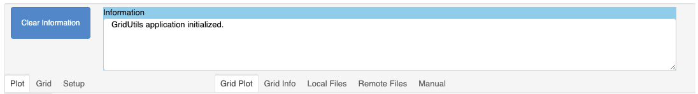
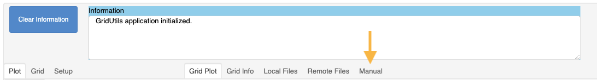

.. _jupyter-grid-generation-application:

***************************
Grid Generation Application
***************************

This section provides detail on the controls
of the grid generation application written
for Jupyter notebooks.

The primary controls are located at the top of the
grid generation application.

A subset of these descriptions are built into
the grid generations "`Manual`" tab.

.. toctree::
   :maxdepth: 2
   :caption: Primary Controls:

   ggPlot
   ggGrid
   ggSetup
   ggGridPlot
   ggGridInfo
   ggLocalFiles
   ggRemoteFiles
   ggManual
   ggInformation
