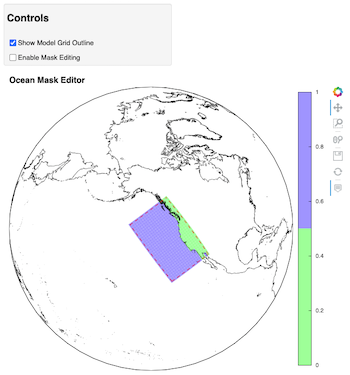

.. _jupyter-mask-editor-application:

*******************
Jupyter Mask Editor
*******************

Once a model grid is read and a map projection created, the application
can be launched with these commands in a jupyter notebook cell::

    # Import needed python modules
    import os, sys
    from gridtools.gridutils import GridUtils
    from gridtools.app import maskEditor
    import cartopy.crs as ccrs

    # Set a map projection for the mask editor
    map_crs = ccrs.Orthographic(-160, 90)

    # Create the mask editor
    appObj = maskEditor(crs=map_crs, ds=grd.grid['mask'])
    app = appObj.createMaskEditorApp()
    display(app)

The map editor should display after the cell is run.

For more information, see ":ref:`edit-grid-jupyter-tutorial`".

**Troubleshooting**

If the application does not show, the jupyter lab session may
need to be restarted.  Errors in the gridtools library also
may prevent the application from showing.
