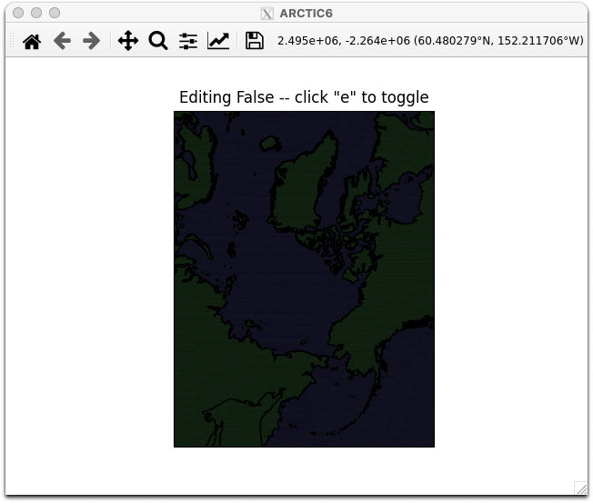
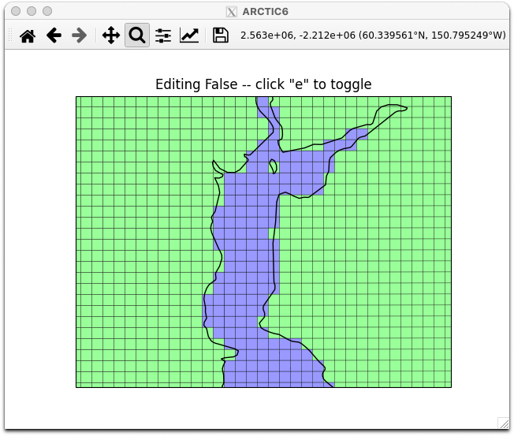

.. _pylab-mask-editor:

*****************
Pylab Mask Editor
*****************

The pylab mask editor is a port of the ROMS grid mask
editor.  This editor can be started in two ways.

The editor will require **X** windows to be operational
and properly forwarded if starting the application on
a remote system.

**ipython**

At a command prompt, start **ipython** with **pylab**.

.. code-block:: bash

    % ipython --pylab

    Python 3.7.10 | packaged by conda-forge | (default, Feb 19 2021, 16:07:37)
    Type 'copyright', 'credits' or 'license' for more information
    IPython 7.24.1 -- An enhanced Interactive Python. Type '?' for help.
    Using matplotlib backend: Qt5Agg

Then, type or copy and paste code into ipython to launch the
editor.  Changes will be retained in memory.  At the conclusion
of editing, use additional python commands to write out the
new grid mask.

.. code-block:: python

    In [1]: import os, sys
       ...: from gridtools.gridutils import GridUtils
       ...: from gridtools.grids import roms
       ...: from pyproj import Proj
       ...: import cartopy.crs as ccrs
       ...:
       ...: # Set a place to write files
       ...: os.environ["ROMS_GRIDID_FILE"] = "/import/AKWATERS/jrcermakiii/configs/ROMS/gridid.txt"
       ...: wrkDir = '/import/AKWATERS/jrcermakiii/configs/zOutput'
       ...: inputDir = os.path.join(wrkDir, 'INPUT')
       ...:
       ...: grd = GridUtils()
       ...:
       ...: romsObj = roms.ROMS()
       ...: romsGrd = romsObj.get_ROMS_grid('ARCTIC6')
       ...:
       ...: map_proj = ccrs.Stereographic(central_latitude=90.0, central_longitude=160.0)
       ...:
       ...: plotObj = romsObj.edit_mask_mesh(romsGrd.hgrid, proj=map_proj)

.. code-block:: python

    In [2]: #...post-editing commands...

**jupyter**

Using jupyter, use the magic function ``%pylab`` to activate
`pylab interactive support <https://ipython.readthedocs.io/en/stable/interactive/magics.html#magic-pylab>`_.

[]::

    # Enable pylab
    %pylab

[]::

    # Load a ROMS grid
    import os
    from gridtools.grids import roms
    import cartopy.crs as ccrs
    import xarray as xr

[]::

    # Define a map projection
    map_proj = ccrs.Stereographic(central_latitude=90.0, central_longitude=160.0)

    # Use the gridid.txt file
    os.environ["ROMS_GRIDID_FILE"] = "/import/AKWATERS/jrcermakiii/configs/ROMS/gridid.txt"

    romsObj = roms.ROMS()
    romsGrd = romsObj.get_ROMS_grid('ARCTIC6')

    # Start the pylab editor
    plotObj = romsObj.edit_mask_mesh(romsGrd.hgrid, proj=map_proj)

Here is the pylab mask editor application after startup:

Here is a zoomed in view of the pylab mask editor:

