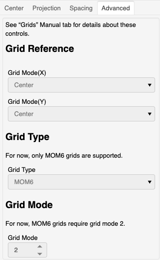

********
Advanced
********

This section describes the "`Advanced`" controls
for generation of the model grid.

For now, these controls are fixed to support only MOM6
model grids.  There may be additional controls added to
the gridtools grid generation application in the future.

Grid Reference
==============

For now, the model grid can only be constructed from the
*grid center*.  In a future release, the grid may be
specified in releation to other points of reference.  For
example, from a western point or north eastern point.  In
which case, the total distance and cell distances would
expand from those boundaries instead of split at a
center point.

Grid Type
=========

For now MOM6, is the only model grid supported by
the grid generation application.

Grid Mode
=========

For MOM6, the grid mode is fixed at two (2).  This
specifies the generation of a supergrid even though
the grid spacing is in reference to the regular
MOM6 model grid cells.  This may become clearer
in future releases.
