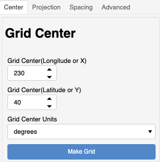

******
Center
******

This section describes the "`Center`" controls
for generation of the model grid.

This is the absolute center point of the entire grid.  The
center may be specified in `degrees` or `meters`.
