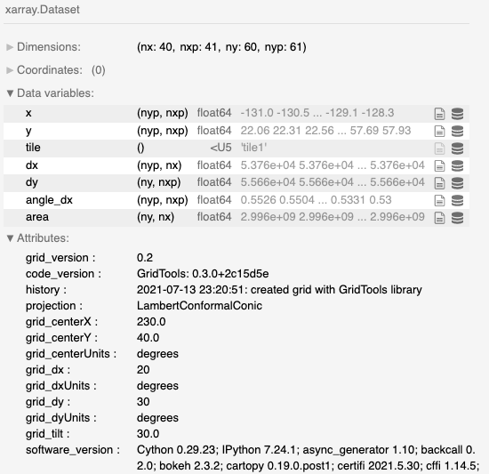

*********
Grid Info
*********

This section describes "`Grid Info`" information tab.

This control displays the data structure currently stored.
This should generally be an xarray Dataset object and should
allow some basic interaction to look at a few values or
important metadata.

Example:

Using a separate jupyter notebook cell, the grid information
may also be accessed.

[1]::

    print(grd.grid.software_version)

::

    Cython 0.29.23; IPython 7.24.1; async_generator 1.10; backcall 0.2.0;
    bokeh 2.3.2; cartopy 0.19.0.post1; certifi 2021.5.30; cffi 1.14.5;
    cftime 1.5.0; chardet 4.0.0; click 7.1.2; cloudpickle 1.6.0;
    colorama 0.4.4; colorcet 2.0.6; cycler 0.10.0; cython 0.29.23;
    cytoolz 0.11.0; dask 2021.6.2; datashader 0.13.0; datashape 0.5.4;
    decorator 5.0.9; defusedxml 0.7.1; distributed 2021.6.2;
    entrypoints 0.3; fiona 1.8.18; fsspec 2021.6.1; geoviews 1.9.1;
    gridtools 0.3.0+2c15d5e; holoviews 1.14.4; hvplot 0.7.2; idna 2.10;
    importlib_metadata 4.5.0; ipykernel 5.5.5; ipython_genutils 0.2.0;
    jedi 0.18.0; jinja2 3.0.1; jsonschema 3.2.0; jupyter_client 6.1.12;
    jupyter_core 4.7.1; jupyterlab_pygments 0.1.2; kiwisolver 1.3.1;
    llvmlite 0.36.0; markdown 3.3.4; markupsafe 2.0.1; matplotlib 3.4.2;
    mistune 0.8.4; msgpack 1.0.2; multipledispatch 0.6.0; nbclient 0.5.3;
    nbconvert 6.1.0; nbformat 5.1.3; netCDF4 1.5.6; notebook 6.4.0;
    numba 0.53.1; numpy 1.21.0; owslib 0.24.1; packaging 20.9;
    pandas 1.2.5; pandocfilters 1.4.2; panel 0.11.3; param 1.10.1;
    parso 0.8.2; pexpect 4.8.0; pickleshare 0.7.5; platform linux-x86_64;
    prompt_toolkit 3.0.19; psutil 5.8.0; ptyprocess 0.7.0;
    pycparser 2.20; pyct 0.4.8; pygments 2.9.0; pykdtree 1.3.4;
    pyparsing 2.4.7; pyproj 3.1.0; pyrsistent 0.17.3; python 3.7.10;
    pytz 2021.1; pyviz_comms 2.0.2; requests 2.25.1; scipy 1.6.3;
    shapely 1.7.1; six 1.16.0; sortedcontainers 2.4.0; tblib 1.7.0;
    testpath 0.5.0; toolz 0.11.1; tornado 6.1; traitlets 5.0.5;
    typing_extensions 3.10.0.0; urllib3 1.26.5; wcwidth 0.2.5;
    xarray 0.18.2; zipp 3.4.1
