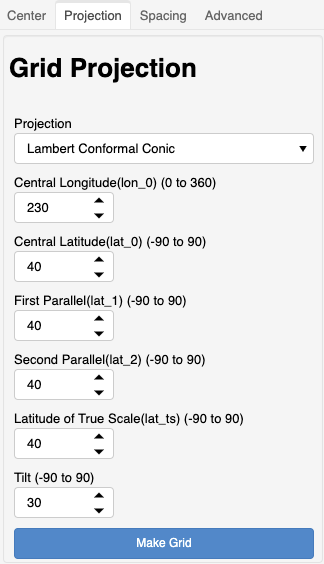

**********
Projection
**********

This section describes the "`Projection`" controls
for generation of the model grid.

Projection
==========

Three grid projections are supported:

 - Mercator
 - Lambert Conformal Conic
 - Stereographic

Please see
`Cartopy projection list <https://scitools.org.uk/cartopy/docs/latest/crs/projections.html>`_
for more details on these projections.

The gridtools library attempts to conform to
`Proj <https://proj.org/operations/projections/index.html>`_
terminology for setting projection parameters such as
**latitude of true scale**.

Here is a comparison of **Cartopy** mapping parameters to
parameters for use with **Proj** and **Gridtools**:

    +---------------------+--------------+-----------------+
    | Cartopy             | Proj         | Gridtools       |
    +---------------------+--------------+-----------------+
    | central_latitude    | lat_0        | lat_0           |
    +---------------------+--------------+-----------------+
    | central_longitude   | lon_0        | lon_0           |
    +---------------------+--------------+-----------------+
    | standard_parallels  | lat_1, lat_2 | lat_1, lat_2    |
    +---------------------+--------------+-----------------+
    | latitude_true_scale | lat_ts       | lat_ts          |
    +---------------------+--------------+-----------------+

**Tilt** is allowed to be specified for all projections.
Conformality of Lambert Conformal Conic grids has been
confirmed with usage of a tilt value that is non-zero.

Setting of **false_easting or false_northing** values is
not implemented.

See also: 
:py:func:`~gridtools.gridutils.GridUtils.setGridParameters`.
