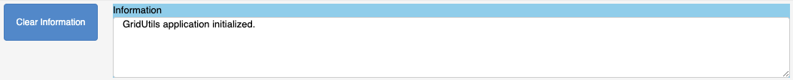
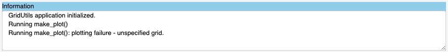

***********
Information
***********

This section describes the "`Information`" window
and control at the top of the application.

When the application is first started, the logging
mechanism is attached to the "`Information`" window.

The application is currently running as a separate
process and controls are weakly connected to the
jupyter notebook.  Any output from the application
is captured and placed into the "`Information`"
window.

.. warning::

    If there is an application error, it is nearly impossible
    to debug since errors are not returned to the jupyter
    notebook.

Any errors or information captured by the application should
be appended to the "`Information`" window.

At any time, the "`Clear Information`" button may be pressed
to clear this window.  Clearing the window will not erase
previously logged information if logging to a file is
enabled.  See: ":ref:`grid-generation-logging`" for more
details on logging.
