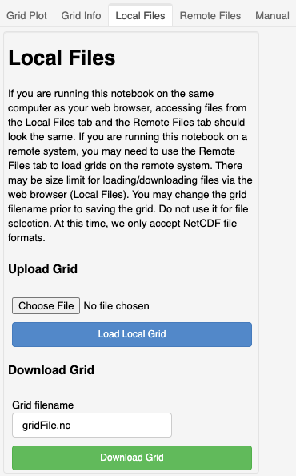

***********
Local Files
***********

This section describes "`Local Files`" control tab.  Use
this transfer if transferring a grid to and from a
remote system.  Transfer to and from a local system is
also possible.

.. warning::
    Some remote systems limit the amount of data that
    can be uploaded at one time.

Upload
======

First choose the file to upload.  Then click
"Load Local Grid" to upload the model grid.

Download
========

Set the file name first.  Then click the
"Download Grid" button.  The file should
begin downloading to the directory
set by the web browsers.  The typical
destination directory is "Downloads".
