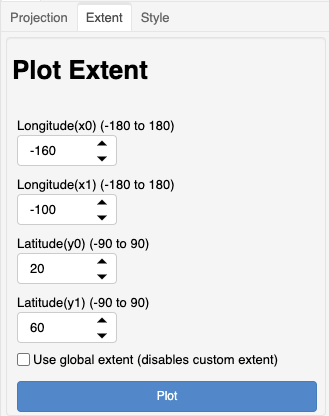

******
Extent
******

This section describes the "`Extent`" controls
for plotting.

The extent controls only work in degrees (at the moment).
The plot extent can be defined using the longitude and
latitude controls or by checking the box to use
a global extent.

These extents are set by the cartopy geoaxes object by calling
`set_extent(x0, x1, y0, y1)`.  When the global extent selected,
the `set_global()` method is used.

See: `geoaxes <https://scitools.org.uk/cartopy/docs/v0.13/matplotlib/geoaxes.html>`_
