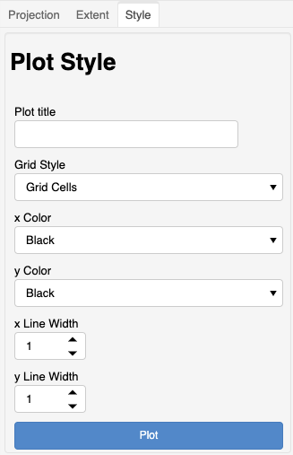
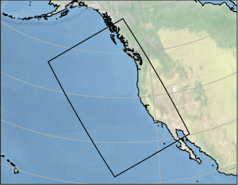
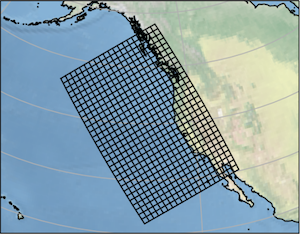
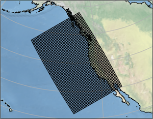
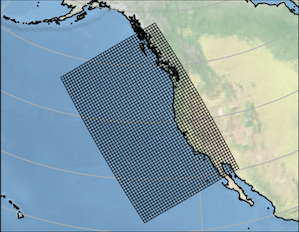

*****
Style
*****

This section describes the "`Style`" controls
for plotting.

The style controls allow for customization of
the plots.

Plot Title
==========

A default title is always generated for every
plot. A custom plot title may be provided
to replace the default title.

Grid Style
==========

One of three styles may be selected.

Grid Extent
-----------

This option will instruct the plot to only
show the outline of the model grid.

Grid Cells
----------

This is the default style for plotting
the model grid. This will show the 
nominal grid cells for the model grid.

Supergrid Cells
---------------

This option will instruct the plot to
show the denser supergrid for the
model grid. *This options supports
MOM6 model grids.*

Line Width
==========

These controls adjust the width of
x and y lines drawn for the
extent or grid cells.  The line width
can be changed from the default
of one (1) dpi.

.. note::

    For denser grids, it may be useful
    to change the length of the x and
    y line width to ``0.5`` or even
    ``0.1`` dpi.  

    Below is an example plot with 
    x and y line width set to ``0.5``.

