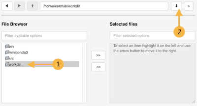
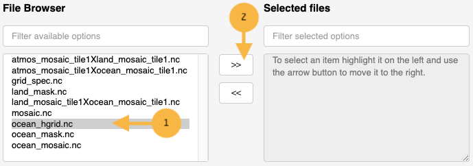
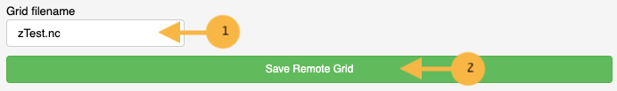
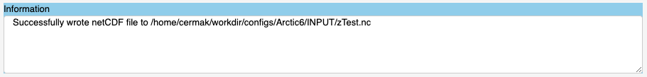
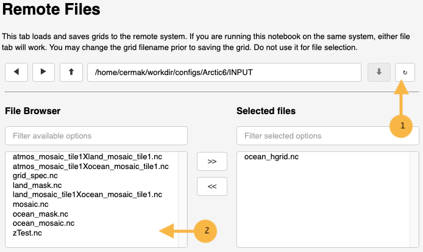

************
Remote Files
************

This section describes "`Remote Files`" control tab.

.. image:: ggRemoteFiles.png

This control is somewhat complicated.  Please
read the directions carefully.

.. warning::
    Large grids may take time to save.  Until the saving
    is complete, the application may appear unresponsive.

    A message should appear in the "Information" window
    indicating success in write the netCDF file.

    Any errors that occur when using this control may
    cause the application to crash and become unresponsive.
    They only way to restart the application is to
    restart the jupyter kernel and re-run all the
    program cells.

Load Remote Grid
================

This control may be used to load any
netCDF file on a remote system running
the jupyter notebook.  This control only
works with files on the remote system
running the jupyter notebook.

**Navigating Directories**

To decend into a directory tree, select the
directory in the "File Browser" (the "left" side)
by clicking once.  Click the down arrow control on
the right hand side to decend into that
directory.

Keep decending until the netCDF file needed
is shown in the "File Browser".  Select
the needed netCDF file and move it using
the control between the "File Browser"
and the "Selected Files".  The controls
show the direction it will move the
selection between windows.

Once the netCDF file is shown in
"Selected files", click on the
blue button "Load Remote Grid".  This
will attempt to load the selected
netCDF file into the grid generation
application.

The "Information" window should indicate
if the grid was loaded successfully.

Save Remote Grid
================

First, navigate to the appropriate directory.
Make sure to decend into the directory and is
shown under the "File Browser".

Update the "Grid filename" text box with the
name file to use to save the model grid.

Press the "Save Remote Grid" button.  For very
large grids, this operation may take some time.
An information message should indicate that the
model grid was saved successfully.

The model grid just saved should appear in the
"File Browser" **AFTER** clicking the refresh
button.

