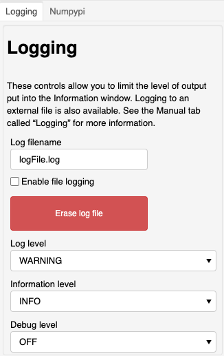
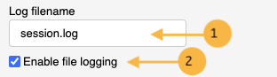

.. _grid-generation-logging:

*******
Logging
*******

This section describes the "`Logging`" controls
for logging and display of messages within the
application.

This is for use with the grid generation application to
assist with debugging and troubleshooting.  These control
the level of information provided to the information box
in the application and to the log file, if enabled.

Instead of taking screen shots of the information window,
messages can be logged to a file by setting a filename
and checking the "Enable file logging" box. **Set the
filename first, then check the checkbox.**

.. note::

  Setting of the debug level above ``MESSAGE`` will not
  do much to help troubleshoot the grid generation
  application.  In most cases, it will cause the 
  application to quit operation at which point, the
  only way to continue is to restart the entire
  notebook.

For the log file to match everything that is displayed in
the "`Information`" window, log level and information
level should use the *SAME* setting.

**See also**

 * :py:func:`gridtools.gridutils.GridUtils.setLogLevel`
 * :py:func:`gridtools.gridutils.GridUtils.setDebugLevel`
 * `Additional logging information <https://github.com/ESMG/gridtools/blob/main/docs/manual/Logging.md>`_
 * An example python script demonstrating the use of the gridtools logging facility: `mkGridsExample02.py <https://github.com/ESMG/gridtools/blob/main/examples/mkGridsExample02.py>`_
