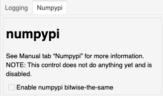

*******
Numpypi
*******

This section describes the "`Numpypi`" controls
for the application.

At the present time, this feature is
**NOT ENABLED**.
In a future release, the ability to use the
``numpypi`` package will be enabled to help
guarantee bitwise-the-same operations
between computer systems.
