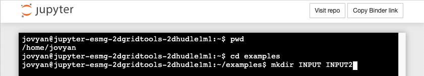

******
Binder
******

The `binder <https://mybinder.org>`_ website allows experimentation with
python notebooks placed on github.  Links to start a gridtools binder
cloud service can be found on the
`github repository site <https://github.com/ESMG/gridtools#mybinderorg>`_.

.. note::
    The binder cloud service, if not actively used, will unexpectedly
    terminate. **All data will be lost!** It is important to save any
    original information efficiently. Any grids or datasets will
    need to be reloaded or regenerated before they can be used
    again on a new cloud service session.

.. _binderGEBCO:

GEBCO
=====

Downloading the GEBCO bathymetry dataset to 
`binder <https://mybinder.org>`_
can be accomplished through the terminal interface.

Launch a terminal from jupyter.

.. image:: binderStartTerminal.png

Change directory to the ``examples`` directory.  If
running the ``NewGridMOM6.ipynb`` example, then also
create ``INPUT`` and ``INPUT2`` directories.

.. code-block:: shell

    $ cd examples
    $ mkdir INPUT INPUT2

This is what the terminal session should look similar to:

Download GEBCO 2020 from the GEBCO website.

.. code-block:: shell

    $ wget "https://www.bodc.ac.uk/data/open_download/gebco/gebco_2020/zip/"

.. note::
    This download will take approximately 20 minutes.

Rename ``index.html`` to ``GEBCO.zip`` and unzip.

.. code-block:: shell

    $ mv index.html GEBCO.zip
    $ unzip GEBCO.zip

This should finally unpack the neede ``GEBCO_2020.nc`` file
which is now available in the ``examples`` directory.   Switch
back to the python notebook and change directory entries to
``.`` or reference the ``GEBCO_2020.nc`` file directly.  

For the ``NewGridMOM6.ipynb`` notebook, these lines will change from:

.. code-block:: python

    # Source of GEBCO 2020 topographic grid
    highResTopographyFile = "/import/AKWATERS/jrcermakiii/bathy/gebco/GEBCO_2020.nc"

    # Write current model grid files
    wrkDir = "/home/cermak/workdir/configs/zOutput"
    inputDir = os.path.join(wrkDir, "INPUT")
    input2Dir = os.path.join(wrkDir, "INPUT2")

to:

.. code-block:: python

    # Source of GEBCO 2020 topographic grid
    highResTopographyFile = "GEBCO_2020.nc"

    # Write current model grid files
    wrkDir = "."
    inputDir = os.path.join(wrkDir, "INPUT")
    input2Dir = os.path.join(wrkDir, "INPUT2")

.. note::
    The code above is in two separate notebook cells!
