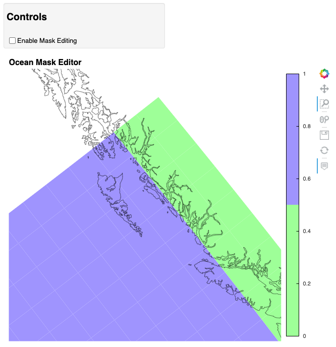

.. _edit-grid-jupyter-tutorial:

Edit a grid mask using Jupyter
==============================

A jupyter notebook was written for editing the
ocean mask for a model grid.

The first step is to load the ocean mask for
a model grid.

::

    # Import needed python modules
    import os, sys
    from gridtools.gridutils import GridUtils
    from gridtools.app import maskEditor
    import cartopy.crs as ccrs

    # Define the model grid directory
    # For existing MOM6 grids, this is often an "INPUT" directory
    wrkDir = '/import/AKWATERS/jrcermakiii/configs/zOutput'
    inputDir = os.path.join(wrkDir, 'INPUT')

    # Create a gridtools object
    grd = GridUtils()

    # Read the ocean mask
    oceanMask = grd.openDataset(os.path.join(wrkDir, 'ocean_mask_Example7.nc'))

    # The mask editor requires 'lat' and 'lon' coordinates for mapping.
    # For MOM6, the x and y dimensions are renamed to lon and lat
    oceanMask = oceanMask.rename({
        'x': 'lon',
        'y': 'lat'
    })
    oceanMask = oceanMask.set_coords(['lon', 'lat'])

    # Set a map projection for the mask editor
    crs = ccrs.Orthographic(-140, 45)

    # Create the mask editor
    appObj = maskEditor(crs=crs, ds=oceanMask['mask'])
    app = appObj.createMaskEditorApp()
    display(app)

This will launch the map editor within the jupyter notebook.

When editing is complete, use and additional jupyter cells to save
the edited ocean mask variable ``oceanMask``.

To keep this cell from running when starting the mask editor, the
``runBlock`` is set to False.  When it is time to save the new mask,
set ``runBlock`` to True and run the cell.

::

    runBlock = False

    if runBlock:
        # Save the new mask without coordinates
        newMask = oceanMask['mask'].copy()
        newMask = newMask.reset_coords(names = ['lat', 'lon'])
        grd.saveDataset(os.path.join(wrkDir, 'ocean_mask_new_Example7.nc'), newMask,
                        overwrite=True, mapVariables = {'lon': 'x', 'lat': 'y'},
                        hashVariables = ['mask', 'x', 'y'])
