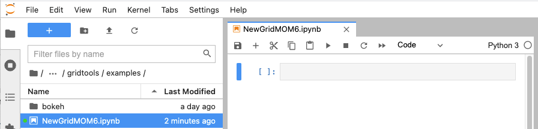
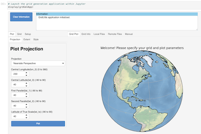
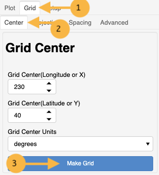
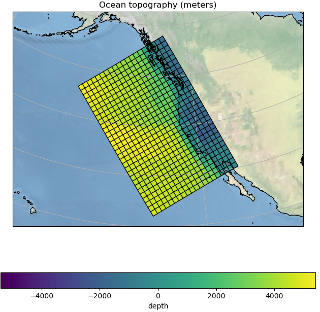
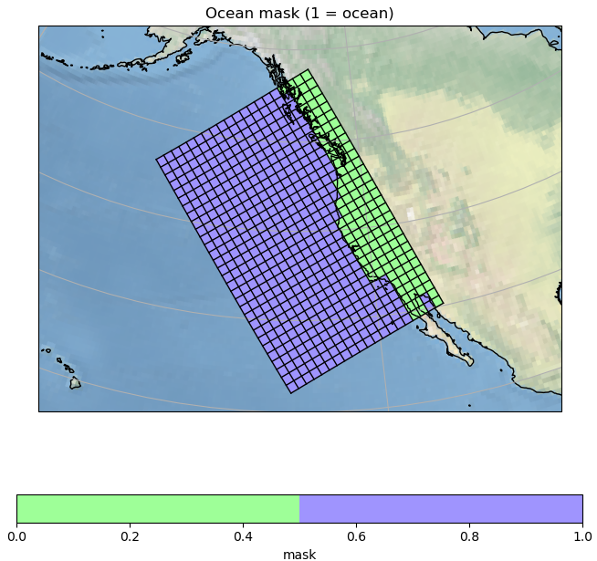
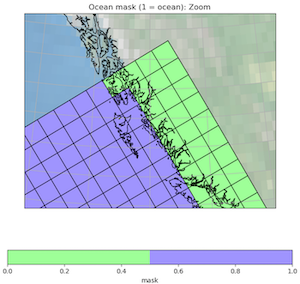
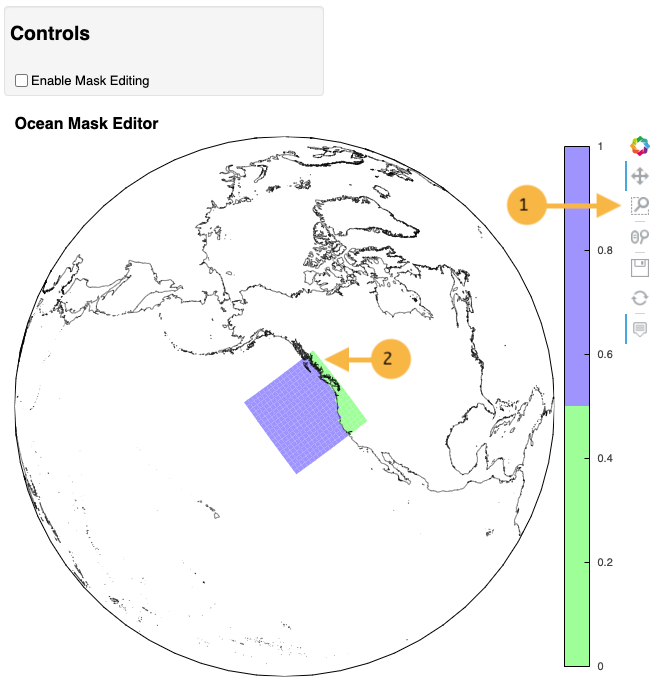
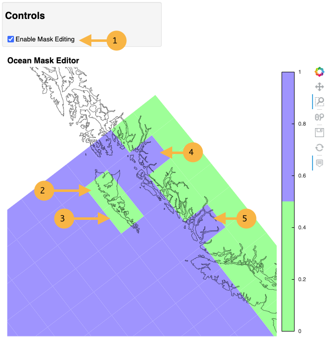
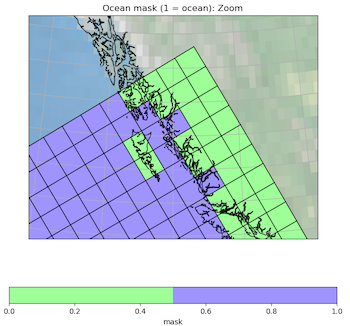

*************************************
Build and Edit a MOM6 Grid in Jupyter
*************************************

This tutorial works through the following operational
elements using the grid generation application and
library functions:

  * :ref:`build-an-initial-grid`
  * :ref:`obtain-roughness-and-topography-grids`
  * :ref:`write-fms-coupler-and-mosaic-files`
  * :ref:`examine-the-topography-grid`
  * :ref:`use-the-editor-to-make-some-mask-updates`
  * :ref:`apply-mask-changes-to-the-model-grid`
  * :ref:`write-updated-FMS-coupler-and-mosaic-files`
  * :ref:`check-final-ocean-mask`

Prerequisites
=============

This tutorial assumes the `gridtools` software has been installed.  A
`local installation tutorial <https://github.com/ESMG/gridtools/blob/main/docs/manual/local_installation_tutorial.ipynb>`_ is available.

It is also assumes that a jupyter lab session is also available.

This tutorial does not cover any details on the controls in
the grid generation application.  Please see
":ref:`jupyter-grid-generation-application`" for details on the
controls in the application.

An existing notebook with the complete code can be found in the
`examples <https://github.com/ESMG/gridtools/tree/main/examples>`_
directory of the github repository.  The name of the example
is ``NewGridMOM6.ipynb``.

This tutorial assumes that code is being systematically added
cell by cell.  Subsequent sections of code need to be set to
``True`` to allow those code blocks to run.

The `GEBCO 2020` topographic dataset is needed for this example.
Be sure the ``GEBCO_2020.nc`` is available for use.  The source
of this dataset is
`available here. <https://www.gebco.net/data_and_products/gridded_bathymetry_data/>`_

Getting Started
===============

Start a **NEW** notebook and rename it to something useful.

.. _build-an-initial-grid:

Build an initial grid
=====================

The first step is to load the `gridtools` library.  The
second step is creating a `gridtools` object and then
launching the grid generation application.

Starting the grid generation application
----------------------------------------

Create three notebook cells.   Each cell will have its
own blocks of code.  When each cell is run, a number will
appear in the brackets.  It is **not** important that the numbers
match between your notebook and the tutorial.

[1]::

    # Load some basic python libraries
    import os, cartopy
    # This loads the GridUtils portion of the gridtools library
    from gridtools.gridutils import GridUtils

[2]::

    # Create a GridUtils object
    grd = GridUtils()

    # Create a grid generation application object
    grdGenApp = grd.app()

[3]::

    # Launch the grid generation application within Jupyter
    display(grdGenApp)

While working with the application, all grid information is stored
internally with the ``grd`` python object created above in cell #2.
Once work is completed with the application, the ``grd`` object will
be used to plot and further manipulate the model grid.

Using the default start up settings of the grid generation application
will generate a 20x30 ocean model grid in the **Lambert Conformal Conic**
projection centered at **40 degrees North** and **230 degrees West**.

For additional details about the operation of the grid generator,
such as adjusting plot, grid parameters and other parameters,
please see ":ref:`jupyter-grid-generation-application`".

Please click on "`Grid`" next to the "`Plot`" tab.  In the "`Center`",
tab, please click on "`Make Grid`".

The area below "`Grid Plot`" should update and display a
20x30 ocean model grid.

.. image:: GridPlot1.png

The new grid is stored with the ``grd`` object and can be
used to generate roughness and topography grids.

.. _obtain-roughness-and-topography-grids:

Obtain roughness and topography grids
=====================================

The location of the `GEBCO 2020` file needs to be set appropriately.

[4]::

    # Detach logger from application
    grd.detachLoggingFromApplication()

    # Source of GEBCO 2020 topographic grid
    highResTopographyFile = "/import/AKWATERS/jrcermakiii/bathy/gebco/GEBCO_2020.nc"

    if os.path.isfile(highResTopographyFile):
        topoGrids = grd.computeBathymetricRoughness(highResTopographyFile,
            depthName='elevation',
            maxMb=99, superGrid=False, useClipping=False,
            auxVariables=['depth'])

The routine ``computeBathymetricRoughness`` is called with the location of
the `GEBCO 2020` topography.  This routine normally only returns a
roughness calculation (``h2``).  As seen above, a request was made for
the ``depth`` grid.  Since `GEBCO 2020` topographic grid is an
**elevation** we have to turn the ``depth`` grid into a
**depth** by taking the negative of the grid.

[5]::

    # Turn the diagnosed topography grid into an actual depth
    topoGrids['depth'] = -(topoGrids['depth'])

.. _write-fms-coupler-and-mosaic-files:

Write FMS coupler and mosaic files
==================================

Let us write the FMS coupler and mosaic files for the current model
grid, roughness and topography.   Edit the ``wrkDir`` variable so
it points to an empty directory.  A subdirectory called ``INPUT`` will
also need to be created.

In a later step, the model grid is rewritten.  This can be to
the existing ``INPUT`` directory or another directory ``INPUT2``
to allow comparison.

[6]::

    # Write current model grid files
    wrkDir = "/home/cermak/workdir/configs/zOutput"
    inputDir = os.path.join(wrkDir, "INPUT")
    input2Dir = os.path.join(wrkDir, "INPUT2")

    # Write FMS coupler and mosaic files
    grd.makeSoloMosaic(
        topographyGrid=topoGrids['depth'],
        writeLandmask=True,
        writeOceanmask=True,
        inputDirectory=inputDir,
        overwrite=True
    )

    # Write topographic variable
    topoGrids.to_netcdf(os.path.join(inputDir, 'ocean_topog.nc'),
            encoding=grd.removeFillValueAttributes(data=topoGrids))

    # Write the model grid
    grd.saveGrid(filename=os.path.join(inputDir, "ocean_hgrid.nc"))

.. note::
    By default, ``makeSoloMosaic`` will only output the files
    needed by the FMS coupler.  Two extra parameters were provided
    to write an ocean and land mask.  These will be used
    later for the ocean mask editor.  The land and ocean masks
    are impacted if additional parameters, MASKING_DEPTH or
    MINIMUM_DEPTH, are specified.  If these are not specified,
    these default to a depth of zero (0.0) meters.  For more
    details, see :py:func:`~gridtools.gridutils.GridUtils.makeSoloMosaic`.

.. _examine-the-topography-grid:

Examine the topography grid
===========================

In this section, two graphics are prepared.  The first
is a look at the current topography grid.  The second
graphic is the ocean mask.

Let us take a closer look at the model grid by plotting a high
resolution coastline over the topography.

First, some plot parameters have to be specified.  The
function :py:func:`~gridtools.gridutils.GridUtils.plotGrid` is
called.  This function returns figure and axes matplotlib objects
that can be further manipulated.  The figures are displayed
by using a display() function.

[7]::

    # Examine the topography grid
    grd.setPlotParameters({
        'figsize': (8,8),
        'projection': {
            'name': 'LambertConformalConic',
            'lon_0': 230.0,
            'lat_1': 25.0,
            'lat_2': 55.0
        },
        'extent': [-160.0 ,-100.0, 20.0, 60.0],
        'iLinewidth': 1.0,
        'jLinewidth': 1.0,
        'showGridCells': True,
        'iColor': 'k',
        'jColor': 'k',
        'transform': cartopy.crs.PlateCarree(),
        'satelliteHeight': 35785831.0
    })
    (figure, axes) = grd.plotGrid(showModelGrid = True,
            plotVariables={
            'depth': {
                'values': topoGrids['depth'],
                'title': 'Ocean topography (meters)',
                'cbar_kwargs': {
                    'orientation': 'horizontal',
                }
            }
        })
    display(figure)

    # Examine the ocean mask
    oceanMask = grd.openDataset(os.path.join(inputDir, 'ocean_mask.nc'))

    # Define our own color map (same used in mask editor)
    import matplotlib.pyplot as plt
    land_color = (0.6, 1.0, 0.6)
    sea_color  = (0.6, 0.6, 1.0)
    maskCM = plt.matplotlib.colors.ListedColormap(
        [land_color, sea_color], name='land/sea')

    # MOM6 places lon and lat in x and y
    # x and y need to be lon and lat coordinates for the mask editor
    oceanMask = oceanMask.rename({
        'x': 'lon',
        'y': 'lat'
    })
    oceanMask = oceanMask.set_coords(['lon', 'lat'])

    (figureMask, axesMask) = grd.plotGrid(showModelGrid = True,
            plotVariables={
            'mask': {
                'values': oceanMask['mask'],
                'title': 'Ocean mask (1 = ocean)',
                'cmap': 'land/sea',
                'cbar_kwargs': {
                    'orientation': 'horizontal',
                }
            }
        })
    display(figureMask)

    # Zoom in to take a closer look
    grd.setPlotParameters({
        'extent': [-140.0 ,-120.0, 49.0, 59.0]
    })
    
    (figureMaskZoom, axesMaskZoom) = grd.plotGrid(showModelGrid = True,
            plotVariables={
            'mask': {
                'values': oceanMask['mask'],
                'title': 'Ocean mask (1 = ocean): Zoom',
                'cmap': 'land/sea',
                'cbar_kwargs': {
                    'orientation': 'horizontal',
                }
            }
        })
    display(figureMaskZoom)

.. raw:: latex

    \newpage

When this cell is run, three plots should appear.

**Ocean Topography**

**Ocean Mask Full Grid**

**Ocean Mask Zoomed**

The ocean mask looks pretty good.  In the next section,
start the grid editor to change some of the points from
ocean to land and land to ocean.

.. _use-the-editor-to-make-some-mask-updates:

Use the editor to make some mask updates
========================================

To start up the mask editor, create a mask editor
object with the desired projection.  Create the
mask editor application object and then use
the display() function to launch the application.

For additional details about the operation of the grid editor,
please see ":ref:`jupyter-mask-editor-application`".

[8]::

    # Load the mask editor application module from gridtools
    from gridtools.app import maskEditor

    # Set a map projection for the mask editor to use
    crs = cartopy.crs.Orthographic(-140, 45)

    # Create the mask editor object
    appObj = maskEditor(crs=crs, ds=oceanMask['mask'])

    # Create the mask editor application object
    app = appObj.createMaskEditorApp()

    # Launch the application
    display(app)

A successful launch of the application should look similar to
the figure below.  Start by selecting the zoom control and
zooming into the same area as the figure above.

Once the zoom tool is selected, click and draw a box over the
region to zoom.  Releasing the mouse button should result
in a redrawn map.

.. image:: MaskEditor2.png

Clicking on the "Enable Mask Editing" checkbox, will allow
mouse clicks on the grid to flip between land and ocean.
Click two ocean boxes to change them to land.  Click two
land points to turn them to ocean.

The new ocean mask can be saved using the following code.

[9]::

    # Save the new ocean mask
    newMask = oceanMask['mask'].copy()
    newMask = newMask.reset_coords(names = ['lat', 'lon'])
    grd.saveDataset(os.path.join(inputDir, 'ocean_mask_new.nc'), newMask,
                    overwrite=True, mapVariables = {'lon': 'x', 'lat': 'y'},
                    hashVariables = ['mask', 'x', 'y'])

.. _apply-mask-changes-to-the-model-grid:

Apply mask changes to the model grid
=====================================

The new ocean mask is applied to the current model grid.  In this
example, the default values are passed to `MASKING_DEPTH`,
`MINIMUM_DEPTH` and `MAXIMUM_DEPTH` to show that these parameters
can be set.  Be sure that these match the parameter values
specified in your MOM6 input files.

[10]::

    # Apply new ocean mask to ocean model grid
    topoGrids['depth'] = grd.applyExistingOceanmask(topoGrids, 'depth',
        os.path.join(inputDir, 'ocean_mask_new.nc'), 'mask',
        MASKING_DEPTH=0.0, MINIMUM_DEPTH=0.0, MAXIMUM_DEPTH=-99999.0)

Of the four points that were changed, this should be the expected result
after running the above routine:

.. code-block:: text

    The (diagnosed) maximum depth of the ocean is 5413.075256 meters.
    Beginning application of new ocean mask (changes noted, if any).
     * Number of land mask points with new depth of 0.000000: 2
     * Number of ocean points with new depth of 0.000000: 2

.. warning::

    The two ocean points with a depth of 0.000000 in this case is
    incorrect.  For MOM6, a `MASKING_DEPTH` set to
    0.000000 means that depths of **0.000000 or shallower** will
    be masked as land.  When the `MASKING_DEPTH` and `MINIMUM_DEPTH`
    are **EQUAL**, an additional depth of `epsilon` is applied so
    the new point is actually an ocean point.  The value of `epsilon`
    may need to be changed if the new ocean points are masked by MOM6.

    See: :py:func:`~gridtools.gridutils.GridUtils.applyExistingOceanmask` or
    :py:func:`~gridtools.gridutils.GridUtils.applyExistingLandmask` for
    additional details.

.. _write-updated-FMS-coupler-and-mosaic-files:

Write updated FMS coupler and mosaic files
==========================================

To finish the process of updating the model grid,
the FMS coupler, mosaic, topography and model grid
are written.

[11]::

    # Rewrite FMS coupler and mosaic files
    grd.makeSoloMosaic(
        topographyGrid=topoGrids['depth'],
        writeLandmask=True,
        writeOceanmask=True,
        inputDirectory=input2Dir,
        overwrite=True,
        MASKING_DEPTH=0.0, MINIMUM_DEPTH=0.0, MAXIMUM_DEPTH=-99999.0
    )

    # Be sure to save previously diagnosed `h2` grid
    topoGrids.to_netcdf(os.path.join(input2Dir, 'ocean_topog.nc'),
            encoding=grd.removeFillValueAttributes(data=topoGrids))

    grd.saveGrid(filename=os.path.join(input2Dir, "ocean_hgrid.nc"))

.. _check-final-ocean-mask:

Check final ocean mask
======================

Plot the final ocean mask to be sure the points are
correctly represented.

[12]::

    (figureMaskZoom2, axesMaskZoom2) = grd.plotGrid(showModelGrid = True,
            plotVariables={
            'mask': {
                'values': oceanMask['mask'],
                'title': 'Ocean mask (1 = ocean): Zoom',
                'cmap': maskCM,
                'cbar_kwargs': {
                    'orientation': 'horizontal',
                }
            }
        })
    display(figureMaskZoom2)

